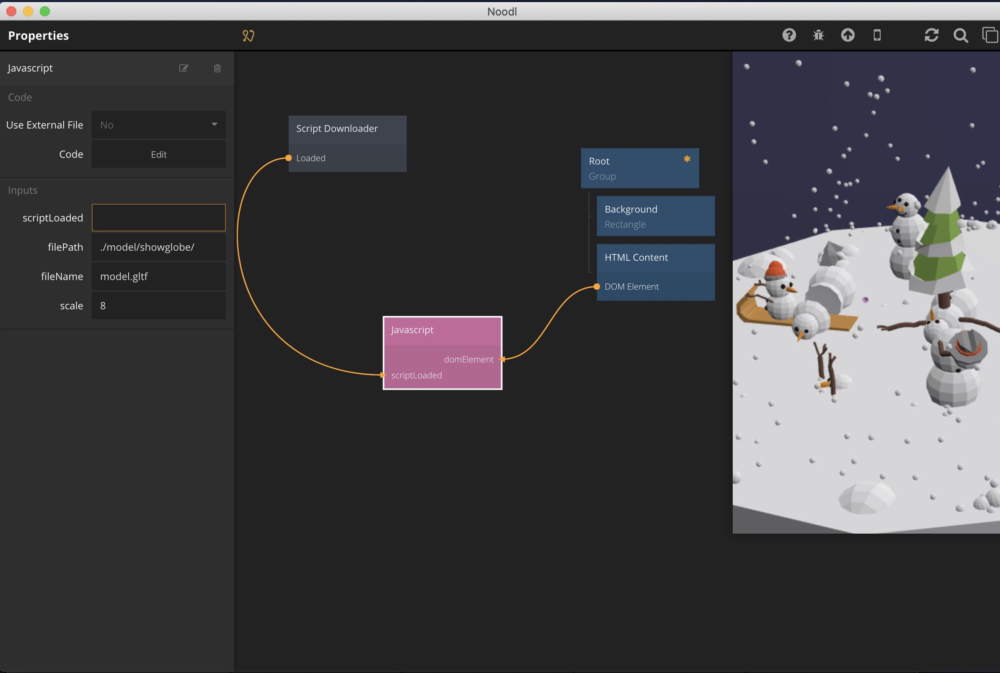
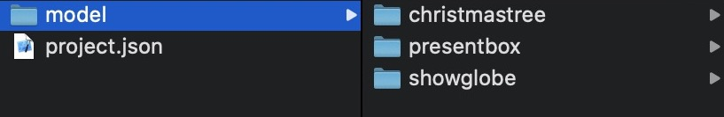
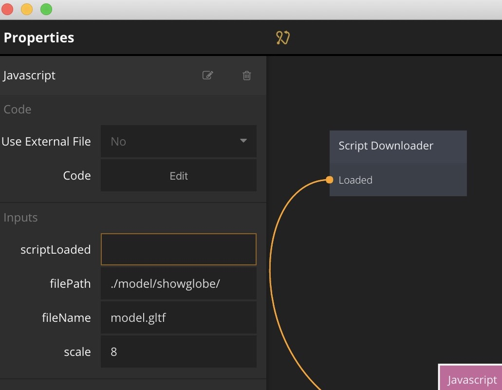
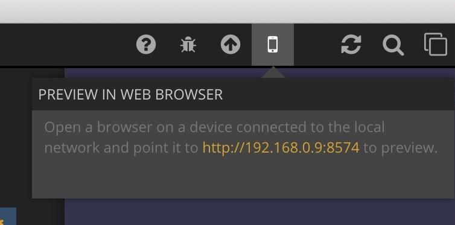

# Noodl_3dcgviewer
Use Noodl ver 1.3.1



# Preparation

## Get 3Dmodel

[Google Poly](https://poly.google.com/) is a good provider.

".glft" is recommended.

## Get Noodl

Get v1.3.1.  https://classic.getnoodl.com/

# Instruction

1. Run Noodl and Add external project   

2. Select the project folder including "project.json".

3. Create "model" folder and put your 3d model in the folder.



4. Select "javascript" node and input filepath and filename.
Ex:   
filePath: ./model/showglobe/ . 
fileName: model.gltf



5. Check preview or access http:// ``` <your PC IP> ``` : ```<port number>```

